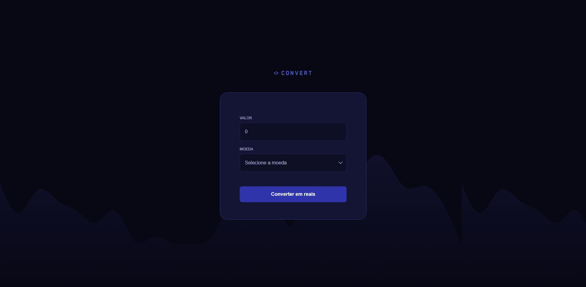

# 💱 Convert — Conversor de Moedas | Currency Converter

Aplicação web desenvolvida com **HTML, CSS e JavaScript**, que realiza conversões de moedas em tempo real utilizando a **AwesomeAPI**.  
O sistema permite converter valores em **Dólar (USD)**, **Euro (EUR)** e **Libra (GBP)** para **Real (BRL)**, exibindo automaticamente a cotação atual e o horário da última atualização.

---

## 🚀 Tecnologias utilizadas | Technologies used
- **HTML5** — estrutura da aplicação | app structure  
- **CSS3** — estilização responsiva | responsive styling  
- **JavaScript (ES6)** — lógica de conversão e integração com API | conversion logic and API integration  
- **AwesomeAPI** — cotações em tempo real | real-time exchange data  
  - Endpoint: `https://economia.awesomeapi.com.br/last/USD-BRL,EUR-BRL,GBP-BRL`

---

## 🧩 Funcionalidades | Features
- Consulta automática das cotações (USD, EUR, GBP → BRL)  
- Conversão instantânea do valor inserido pelo usuário  
- Exibição da cotação atual e da hora da última atualização no rodapé  
- Validação de entrada (aceita apenas números)  
- Interface moderna e intuitiva  

---

## 📷 Demonstração | Preview


---

## 🌐 Live Demo | Demonstração ao vivo
Veja o projeto em funcionamento | See it live:  
👉 [Convert - Currency Converter](https://camilodf.github.io/convert/)

---

## ⚙️ Como executar o projeto | How to run locally
1. **Clone este repositório | Clone this repository:**
   ```bash
   git clone https://github.com/seu-usuario/convert.git

## 📂 Estrutura do projeto | Project structure
/ (root)<br>
├─ index.html<br>
├─ css/<br>
│  └─ style.css<br>
├─ js/<br>
│  └─ main.js<br>
└─ assets/<br>

## 🧠 Aprendizados | Learnings

Durante o desenvolvimento, trabalhei com:
While developing this project, I worked with:

Manipulação do DOM em JavaScript puro | DOM manipulation in vanilla JS

Uso de APIs públicas com fetch() | Working with public APIs using fetch()

Formatação de moedas e datas no padrão brasileiro | Formatting currency and date in BR format

Organização de pastas e boas práticas de código | Folder organization and clean code practices

## 🪪 Licença | License

Projeto licenciado sob MIT License — sinta-se livre para usar e modificar.  
This project is under MIT License — feel free to use and modify.

👨‍💻 Desenvolvido por Camilo Dalcim Franzini  
Developed by Camilo Dalcim Franzini